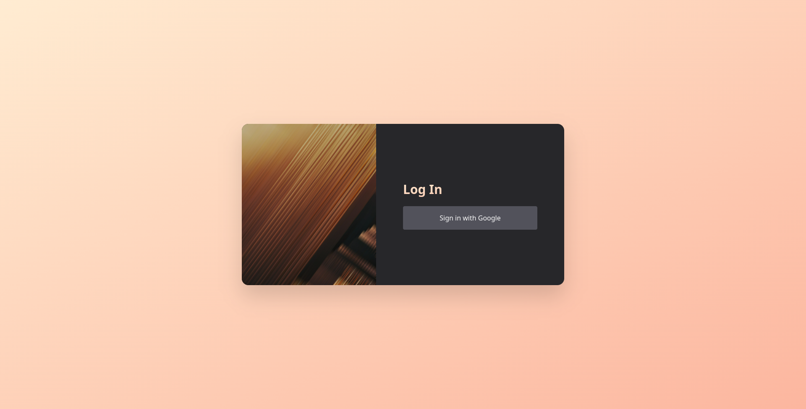

> ⚠ We will be completing these steps as part of the workshop, but if you are unable to attend (or want to go at your own pace), you are welcome to work through these on your own.

# Using Git
Throughout the workshop, we recommend committing (and pushing) your changes after each step to make sure you don't lose any progress. GitKraken makes this pretty easy, and they have fantastic [tutorials](https://www.gitkraken.com/learn/git/tutorials) to get you familiar with using `git`.

# Setting up Libraries

# Connecting to Supabase

## Adding Supabase to our project
Adding some libraries to svelte is very easy, supabase and tailwind included.

Run this snippet to add supabase to your code:
```bash
npx apply supabase-community/svelte-supabase // Add supabase boilerplate
npm i 										 // Install Dependencies
```

Open your project in Supabase, and fill in the appropriate fields in the `.env` file. 

**Remove the `SUPABASE_PRIVATE_KEY` and `SUPABASE_JWT_SECRET` lines, we won't need them for this project, and they can pose a security risk.**

You should end up with something like this:
```
# .env
VITE_SUPABASE_URL=[[ Project Configuration -> URL ]]
VITE_SUPABASE_ANON_KEY=[[ Project Api Keys -> anon public ]]
```

Next, lets make a couple tweaks to the generated `src/lib/db.js`, these are optional, and mostly stylistic, but it will keep things consistent as we continue on.
1. Rename `db.js` to `db.ts`
2. Delete line 8:
	```typescript
	export default supabase
	```
3. Change line 3:
	```typescript
	// Add export
	export const supabase = createClient(
	```

## Creating our first table
Under the hood, Supabase's database is just [Postgres](https://www.postgresql.org/), an excellent open source database.
Lets get our first table set up, using one of the presets they provide.
- First, open the project, and find the `SQL Editor` (an icon on the left sidebar)
- Under `Getting Started / Welcome`, there is a section `Quick Start`, find the `User Management Starter`
- Open the `User Management Starter`, and click `Run`.
	- You can confirm that it worked correctly by opening the `Table Editor` (another icon on the sidebar), and making sure that a `profiles` table exists.


## Testing it all together

Once you've completed these steps, open `src/routes/index.svelte` and replace it with the following block:
```html
<script>
	// Import our new supabase client
    import {supabase} from "$lib/db";
</script>
<!-- Attempt to select all user profiles -->
{#await supabase.from("profiles").select("*")}
<!-- Show a loading indicator -->
    Loading...
{:then r}
<!-- Display the HTTP status that is returned -->
    {r.status}
{/await}
```

Now we can run our project:
```bash
npm run dev
```

It should show something similar to this, which includes the URL for our local app.
```
  VITE v3.0.0  ready in 220 ms

  ➜  Local:   http://127.0.0.1:5173/ <-- This is the link to our local app
  ➜  Network: use --host to expose
```

If you see `200`, then you have configured Supabase correctly; otherwise, double check that you have followed the steps correctly.


# Installing Tailwind

Setting up tailwind should be very straightforward,
1. Run the setup script
	```
	npx svelte-add@latest tailwindcss
	```
2. Configure the newly made `postcss.config.csj`
	3. Add this line at the top of the file:
	```typescript
	const nesting = require("tailwindcss/nesting");
	```
	4. Add `nesting()` to the array of plugins before `tailwindcss()`

To confirm that it's working, go to `src/routes/index.svelte` again, and we'll replace it with:
```html
<div class="w-64 h-64 bg-blue-200"></div>
```
Run the app, and if you see a blue square on the screen, then tailwind has been set up!


# Building the Bones
There are two approaches that are often taken when designing an app; "Mobile First" and "Desktop First",
which at a very distilled level, is if you design / build the mobile version of the app before the desktop one, or vise versa.

We will be using a desktop first approach, but we will go over some basics of making our page responsive.

For each step, the code is available, but try to use Figma and the provided screenshot of the result to take a stab at it before peeking, it makes all the difference. Anything that is not tailwindcss, or part of the default configuration for tailwind will be noted outside the code block.

---

## Creating the background

### Goals
 - Create our container element

### Hints
 - Don't worry about the gradient in the background, we'll get to that towards the end; I'll be using `orange-200` as a standin color.

<details>
<summary>🔗 Related Links</summary>

- [Tailwind Width](https://tailwindcss.com/docs/width)  
- [Tailwind Height](https://tailwindcss.com/docs/height)

</details>

<details>
<summary>👀 View Code</summary>

```html
<!-- src/routes/index.svelte -->

<!-- This element will have the height and width of the screen -->
<main class="w-screen h-screen bg-orange-200">

</main>
```

</details>

### End Result


---

## Creating the Content Card

### Goals
 - Create the content card
   - Style it, but without any content

### Hints
 - `slate-800` is the background color
 - The card uses a non-standard width, `w-[768px]` is the class to match figma.
 - We will center the card in the next step

<details>
<summary>🔗 Related Links</summary>

- [Tailwind Background Color](https://tailwindcss.com/docs/background-color)
- [Tailwind Border Radius (Rounding)](https://tailwindcss.com/docs/border-radius)
- [Tailwind Drop Shadow](https://tailwindcss.com/docs/drop-shadow)

</details>

<details>
<summary>👀 View Code</summary>

```html
<!-- src/routes/index.svelte -->

<main class="w-screen h-screen bg-orange-200">
	<!-- w-[768px] lets us override the available tailwind widths to provide our own -->
    <section class="w-[768px] h-96 bg-zinc-800 rounded-2xl drop-shadow-2xl">
	    <!-- ❔ why is this not centered? -->
    </section>
</main>
```

</details>

### End Result


## Centering the Content Card

### Goals
 - Center the Content Card on the page
 - Get comfortable with flebox in Tailwind

### Hints
 - We won't be changing the content card at all in this step.

<details>
<summary>🔗 Related Links</summary>

- [Tailwind Display](https://tailwindcss.com/docs/display)  
- [Tailwind Justify Content](https://tailwindcss.com/docs/justify-content)  
- [Tailwind Align Items](https://tailwindcss.com/docs/align-items)

</details>

<details>
<summary>👀 View Code</summary>

```html
<!-- src/routes/index.svelte -->

<!--                                         Note the 3 new classes here-->
<main class="w-screen h-screen bg-orange-200 flex justify-center items-center">
	<section class="w-[768px] h-96 bg-zinc-800 rounded-2xl drop-shadow-2xl">
	    <!-- ❕ now this is centered -->
    </section>
</main>
```

</details>

### End Result


---

## Adding our Stock Photo

### Goals
 - Place the stock photo into our card
   - We also need to make sure that we aren't stretching the photo, while still constraining it to the space we want it in.

### Hints
 - The image is `w-80` wide
 - We need to wrap our `img` element in another element for this effect to work.

<details>
<summary>🔗 Related Links</summary>

- [Tailwind Width](https://tailwindcss.com/docs/width)
- [Tailwind Overflow](https://tailwindcss.com/docs/overflow)
- [Tailwind Border Radius (Rounding)](https://tailwindcss.com/docs/border-radius)

</details>

<details>
<summary>👀 View Code</summary>

```html
<main class="w-screen h-screen bg-orange-200 flex justify-center items-center">
	<section class="w-[768px] h-96 bg-zinc-800 rounded-2xl drop-shadow-2xl flex">
	    <div class="w-80 overflow-clip rounded-l-2xl">
			
		</div>
    </section>
</main>
```

</details>

### End Result


---


## Adding our Sign In Button and Text

### Goals
 - Add header text
 - Add sign in button

### Hints
 - Think about what we've used that lets us lay this out as a column
 - This is the largest step!

<details>
<summary>🔗 Related Links</summary>

- [Tailwind Padding](https://tailwindcss.com/docs/padding)
- [Tailwind Background Color](https://tailwindcss.com/docs/background-color)

- [Tailwind Text Align](https://tailwindcss.com/docs/text-align)
- [Tailwind Text Color](https://tailwindcss.com/docs/text-color)
- [Tailwind Font Size](https://tailwindcss.com/docs/font-size)


- [Tailwind Display](https://tailwindcss.com/docs/display)
- [Tailwind Flex Direction](https://tailwindcss.com/docs/flex-direction)
- [Tailwind Justify Content](https://tailwindcss.com/docs/justify-content)  
- [Tailwind Gap](https://tailwindcss.com/docs/gap)
- [Tailwind Font Weight](https://tailwindcss.com/docs/font-weight)
- [Tailwind Border Radius (Rounding)](https://tailwindcss.com/docs/border-radius)
- [Tailwind Flex](https://tailwindcss.com/docs/flex)

</details>

<details>
<summary>👀 View Code</summary>

```html
<main class="w-screen h-screen bg-orange-200 flex justify-center items-center">
	<section class="w-[768px] h-96 bg-zinc-800 rounded-2xl drop-shadow-2xl flex">
		<div class="w-80 overflow-clip rounded-l-2xl">
			
		</div>
		<div class="flex-1 flex flex-col justify-center gap-4  px-16">
			<h1 class="text-orange-200 text-3xl font-bold">Log In</h1>
			<button class="p-4 bg-zinc-600 text-zinc-50 rounded">Sign in with Google</button>
		</div>
	</section>
</main>
```

</details>

### End Result


---

## Adding the Gradient

### Goals
 - Seeing another case of using non-standard values in tailwind

For this step, we'll be adding a `<style>` tag to our element, and using that to construct gradients for our background and text.

To begin, add to the bottom of your (almost) finished component:
```html
<style lang="postcss">
	.bg-peach {
		@apply from-[#FFECD2] to-[#FCB69F] bg-gradient-to-br;
	}

	.text-peach {
		@apply from-[#FFECD2] to-[#FCB69F] bg-gradient-to-br 
                text-transparent bg-clip-text leading-relaxed;
	}
</style>
```

Next, add the `bg-peach` class to your background element (`main` in the provided examples), and the `text-peach` class to your "Log In" element (`h1` in the provided examples).

Now that we have the gradient added, lets break down what happened a little bit:

Svelte components consist of three parts:
- `<script>`
- `<style>`
- The content of the component, as HTML

By adding `<style lang="postcss">` we've both added a place for our CSS to live, as well as indicated to Svelte that we will be writing `PostCSS` <sup>TailwindCSS is built on top of postcss</sup>.

Next, we've defined some selectors, `.bg-peach` and `.text-peach`, just like we would in CSS. Things don't really start getting weird until we run into `@apply`. The `@apply` statement is a Tailwind construct to combine tailwind classes into larger ones. It is most commonly used to create reusable [components](./README.md#components), but can also be used to get tailwind classes out of your markdown and into the `<style>` block (see [`index.svelte` from the example](./project/src/routes/index.svelte#L21))

In this case, we are combining the classes needed to build a [gradient](https://tailwindcss.com/docs/gradient-color-stops), because repeating them in multiple places would make consistency much harder over time.


### End Result


---


## Connecting the Sign In Button to Supabase

### Goals
 - Add an `on:click` to our button
 - Allow the user to sign in via Supabase

### Hints
 - If everything is working, you should be taken to the Google OAuth page when you click the button, and returned to your app after signing in through Google

<details>
<summary>🔗 Related Links</summary>

 - [Supabase `signIn()`](https://supabase.com/docs/reference/javascript/auth-signin#sign-in-using-third-party-providers)
 - [Svelte `on:click`](https://svelte.dev/docs#template-syntax-element-directives-on-eventname)


</details>

The code
```html
<script lang="ts">
	import {supabase} from "$lib/db"

	const signin = () => {
		supabase.auth.signIn({ provider: "google" });
	};
</script>


<!-- ... -->
<button on:click={sign in}>Sign In with Google</button>
<!-- ... -->
```

---

# Building the `CurrentUser` Store

First, begin by creating `src/lib/CurrentUser.store.ts`, the file extension `.store.ts` is a helper to make it more clear what the content of the file is.

We will use a [Readable Store](https://svelte.dev/docs#run-time-svelte-store-readable) to make accessing the current authentication state more ergonomic in Svelte.

This store cannot have it's value modified externally, so all the logic we need will be encapsulated in the store itself. This provides a very simple and clean interface to consumers of the store.

Lets begin by importing everything we will need:
```typescript
import type { User } from "@supabase/gotrue-js";
import { readable } from "svelte/store";
import { supabase } from "$lib/db";
```

Next, we will start to define the store
```typescript
// The first argument to Svelte stores is the initial value
const initialValue = supabase.auth.user();
export const CurrentUser = readable<User | null>(initialValue);
```

If you haven't worked in a language with [generics](https://www.typescriptlang.org/docs/handbook/2/generics.html), the `<type>` syntax indicates some type that the statement (e.g. class, function, etc) will use. 

In this case, we are indicated that the type of this store's value will be either a supabase `User` or `null`. We are using `null` to indicate that there is no current user (i.e. the user is signed out).

Right now, we're most of the way there, but when the user signs out (or signs in), the store's value won't update, so our Svelte components using this store won't update (no reactivity).

We can solve this and finish implementing our store by passing a second argument to the store:
```typescript
const initialValue = supabase.auth.user();
export const CurrentUser = readable<User | null>(
    initialValue,
	
    // New Argument
    (set) => {
        supabase.auth.onAuthStateChange((event, session) => {
            if (session?.user) {
                set(session.user)
            } else {
                set(null)
            }
        })
    }
)
```

This new argument is a function that accepts the `set` parameter, a function used to update the store's value.

The event hook `onAuthStateChange` is automatically called when a user signs in or out. If the user exists on the `session`, we `set()` the store's value to the user; and if not, we `set()` the store's value to `null`.

As a quick and dirty test, we can import the new store and display it's value on our sign in page.

```html
<!-- the top of the file should now look like this -->
<script lang="ts">
	import {supabase} from "$lib/db"
	import {CurrentUser} from "$lib/CurrentUser.store";
</script>


<!-- show the contents of the CurrentUser store -->
<pre>{JSON.stringify($CurrentUser, null, 2)}</pre>
```

<!-- Before moving on to the next step, try to add an extra button to the sign in page that will log you out; or better yet, make the sign in button change to a logout button based on if you are signed in or not.


Finally, we can put it together and set up our page to show a `Sign in with Google` button for users who are not signed in, or a `Sign Out` button for users who are signed in. -->

## Adding dynamic behavior

We are starting to get in to somewhat contrived design for the sake of example; usually I prefer to have my sign in page send already signed in users along to the main page for the app. That being said, the exercise is still helpful - and if you've been using git as we suggested, it will be easy to undo all of the changes.

### Goals
 - Adapt the sign in page to show a sign out button to users who are already signed in.

### Hints
 - 

<details>
<summary>🔗 Related Links</summary>

- [Svelte {#if}](https://svelte.dev/docs#template-syntax-if)
- [Svelte Autosubscriptions](https://svelte.dev/docs#component-format-script-4-prefix-stores-with-$-to-access-their-values)


</details>

<details>
<summary>👀 View Code</summary>

```html
<script lang="ts">
	// ...

	const signout = async () => {
		await supabase.auth.signOut();
    }
</script>


			<!-- ... -->
			{#if $CurrentUser}
				<h1>Sign Out</h1>
				<button on:click={signout}>Sign Out</button>
			{:else}
				<h1>Sign In</h1>
				<button on:click={signin}>Sign In with Google</button>
			{/if}
			<!-- ... -->
```

</details>

### End Result


---